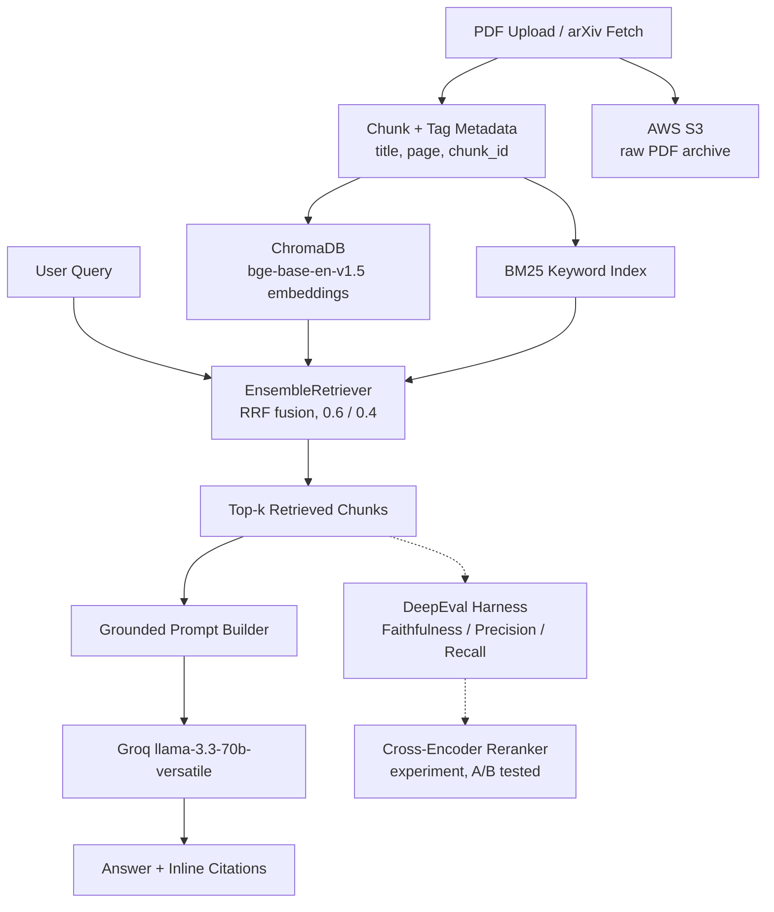

# Knowledge Intelligence System: AI/ML Research Assistant

A hybrid-search RAG system purpose-built for AI/ML research papers — combining semantic and keyword retrieval, grounded citations, and rigorous DeepEval-based evaluation.

<!-- TODO (Phase 12): add live demo badge/link here once deployed, e.g.
[](YOUR_HF_SPACES_URL) -->

---

## Introduction

Research papers are dense, jargon-heavy, and full of exact figures, model names, and equations that a generic document-QA tool tends to mishandle — either paraphrasing precise numbers into vagueness or hallucinating details that sound plausible but aren't grounded in the source. This project builds a research-paper assistant specifically designed around that problem: it retrieves using both semantic *and* keyword search so exact terms (model names, percentages, p-values) aren't lost to pure vector similarity, grounds every answer in numbered, page-and-source-tagged citations so claims can be verified against the original text, and is evaluated with an automated harness (DeepEval) rather than informal spot-checking. The system supports ingesting papers either by direct PDF upload or by searching and fetching directly from arXiv.

## Data Description

- **Sources:** research papers in PDF form, ingested via two paths — manual upload through the Streamlit UI, or automatic fetch-by-search from the arXiv API.
- **Test corpus used during development:** three papers spanning different subfields, deliberately chosen to stress-test retrieval on dense, jargon-heavy text:
  - *AR-RAG: Autoregressive Retrieval Augmentation for Image Generation* (arXiv 2506.06962)
  - *Prompt Injection in Automated Résumé Screening with Large Language Models* (arXiv 2606.27287)
  - A third paper on cross-encoder reranking, ingested to validate multi-paper retrieval scoping
- **Processing pipeline:** PDFs are parsed page-by-page (`pypdf`), then split into ~800-character chunks with 150-character overlap (`RecursiveCharacterTextSplitter`). Chunking is deliberately done *per page*, not across page boundaries, so every chunk keeps an accurate page number for citation — the tradeoff is that a sentence spanning a page break can be split, a known, accepted limitation.
- **Metadata captured per chunk:** paper title, author list, page number, and a unique `chunk_id` (e.g. `2606.27287v1.pdf_p10_c2`) — this is what makes citation rendering and source verification possible downstream.
- **Storage:** raw PDFs are archived to AWS S3 (`papers/` prefix) independent of the vector store, so the original source document always survives even if the embedding index is rebuilt.

## Objectives

- To build a domain-specific RAG assistant for AI/ML research papers that handles dense jargon, exact figures, and model names without falling back on vague paraphrasing.
- To implement hybrid retrieval — combining semantic embeddings and BM25 keyword search — so exact-term queries aren't lost to pure vector similarity.
- To ground every generated answer in numbered, verifiable citations tied to paper title, page number, and chunk ID.
- To evaluate the system rigorously with DeepEval (Faithfulness, Context Precision, Context Recall) rather than informal manual testing alone.
- To measure, not assume, the impact of design choices — including a documented A/B test of retrieval weights and a cross-encoder reranking experiment.

## Tech Tool Stack

| Layer | Tool |
|---|---|
| Orchestration | LangChain (`langchain-classic` for `EnsembleRetriever`) |
| Vector store | ChromaDB |
| Embeddings | `BAAI/bge-base-en-v1.5` (local, via `sentence-transformers`) |
| Keyword search | BM25 (`rank-bm25`, persisted via pickle) |
| Hybrid fusion | Reciprocal Rank Fusion (RRF), weighted 0.6 semantic / 0.4 BM25 |
| Reranking (experimental) | `cross-encoder/ms-marco-MiniLM-L-6-v2` |
| LLM (generation) | Groq — `llama-3.3-70b-versatile` |
| LLM (evaluation judge) | Groq — `qwen/qwen3-32b`, via `instructor` for structured output |
| Evaluation | DeepEval (Faithfulness, Contextual Precision, Contextual Recall) |
| Frontend | Streamlit |
| Document storage | AWS S3 |
| Paper sourcing | arXiv API |
| Environment | Conda, Python 3.10 |
| Containerization | Docker (multi-stage build, CPU-only PyTorch) |

## Running Locally with Docker

```bash
docker build -t hybrid-rag-app .
docker volume create rag-chroma-data
docker run -p 8501:8501 --env-file .env -v rag-chroma-data:/app/chroma_db hybrid-rag-app
```

Then open `http://localhost:8501`.

**Note:** use a named Docker volume (`rag-chroma-data`), not a bind mount to a local folder — bind-mounted SQLite databases (used internally by ChromaDB) can behave unreliably through Docker Desktop's Windows/WSL2 file-sharing layer.

## Methodology



Papers enter the system through one of two ingestion paths — manual PDF upload or arXiv search — and are chunked page-by-page with title, author, page, and chunk-ID metadata attached before being written into both ChromaDB (dense embeddings) and a persisted BM25 index, while the raw PDF is archived to S3 independently. At query time, an `EnsembleRetriever` runs both retrievers in parallel and fuses their rankings via weighted Reciprocal Rank Fusion (0.6 semantic / 0.4 keyword), so exact terms aren't lost to embedding similarity alone. Retrieved chunks are numbered and inserted into a grounded prompt instructing the LLM (Groq's `llama-3.3-70b-versatile`) to cite sources inline as `[n]` or explicitly decline rather than guess. The same numbering renders as a verifiable source list in the UI. A separate offline DeepEval harness — using a different model, `qwen/qwen3-32b`, as judge — scores Faithfulness, Context Precision, and Context Recall, and was used to run a documented A/B test on the fusion weights and a cross-encoder reranking experiment.

## Implementation and Results


### Dense retrieval sanity check (Phase 2)


First end-to-end test of the embedding pipeline: chunks from the AR-RAG paper embedded with `bge-base-en-v1.5` and queried via ChromaDB. All three results-confirming the embedding model, vector store, and metadata tagging (title, page, chunk ID) were wired correctly before adding keyword search.

### Dense-only vs. hybrid retrieval comparison (Phase 3)


A direct, reproducible comparison run on the same corpus and queries, contrasting pure dense (semantic) retrieval against the hybrid (semantic + BM25) retriever. This is the evidence that motivated keeping BM25 in the pipeline at all — semantic-only retrieval can miss exact-term matches (e.g. precise dataset names, affiliations) that keyword overlap reliably catches, which hybrid fusion preserves without sacrificing conceptual recall.

### Grounded generation with inline citations (Phase 4)


A two-part test question ("what does AR-RAG propose, and what dataset was used in the ablation study?"). The system correctly cites sources `[1][5]` for the part it could answer, and — critically — explicitly states the dataset name was *not* found in the provided sources rather than guessing. This grounded-refusal behavior, not just citation formatting, is the core trust property the project is built around.

### Evaluation Set

All evaluation results below (RRF weight A/B test and reranking experiment) were run against the same curated set:

- **7 question–answer pairs**, verified against the source papers before evaluation
- **6 factual** questions (exact figures or named entities: rank gains, a p-value, a success rate, a dataset name, an author affiliation, two model names)
- **1 conceptual** question (a "what does this method propose" summarization-style question)
- **2 of the 7** are marked known retrieval gaps — confirmed via manual diagnosis prior to automated evaluation — specifically included to test whether each retrieval configuration could recover them

### RRF weight A/B test (Phase 7)

| Weights (semantic / BM25) | Faithfulness | Context Precision | Context Recall |
|---|---|---|---|
| **0.6 / 0.4 (chosen default)** | **1.000** | **0.586** | **1.000** |
| 0.5 / 0.5 | 0.964 | 0.524 | 0.571 |

The literature-recommended 0.6/0.4 split outperformed an even 0.5/0.5 split on all three metrics in a single-trial DeepEval comparison. The 0.6/0.4 weighting consistently retrieved the required evidence for all 7 evaluated queries, whereas the 0.5/0.5 configuration failed on three exact-information questions - a ranking statistic, a dataset name, and an author affiliation - resulting in substantially lower Context Recall (1.000 vs. 0.571). 0.6/0.4 was kept as the production default. *(Single-trial result on a small, 7-question evaluation set; LLM-judge scoring has inherent run-to-run variance, noted as a limitation.)*

### Cross-encoder reranking experiment (Phase 8)

| Configuration | Faithfulness | Context Precision | Context Recall |
|---|---|---|---|
| **Hybrid only (production)** | **1.000** | 0.586 | **1.000** |
| + Cross-encoder reranker | 0.924 | 0.576 | 0.929 |

I built and tested a reranker (`cross-encoder/ms-marco-MiniLM-L-6-v2`). It works by first pulling 20 possible chunks using hybrid search, then picking the best 5 from those. I tested this twice — the first test found a bug in how I was scoring answers, which I then fixed. After fixing the bug, the reranker did not improve Precision, and it actually lowered Recall. The reason: this reranker is trained on general web search data, so it prefers chunks that sound broadly relevant over chunks that contain one exact fact — which matters more in dense research papers. The reranker is fully built and tested, but it is not used in the final app. See Key Challenges below for more on this.


## Key Challenges

- LangChain updated their code and moved a key tool (EnsembleRetriever) to a new package without warning. This broke hybrid search until I found where it moved.
- Free LLM judges were unreliable: Gemini's daily limit was just 20 requests, and a small Groq model failed at structured output, so I tested several models.
- A test answer written as just "7.4%" broke the Recall score, making a correct answer look wrong. Fixing the wording fixed it.
- A reranker looked like an improvement at first, but after fixing a scoring bug, it actually lowered Recall.

## Walkthrough Screenshots

1. The sidebar's **Upload PDF** tab with title/author fields to be filled by user.


2. The sidebar's **Search arXiv** tab, showing search results and an "Ingest this paper" action


3. A chat exchange with a generated answer showing inline `[n]` citations and knowledge base list in the sidebar showing ingested papers.


4. The expanded **View sources** panel showing numbered sources matching the citations above


<!-- TODO (Phase 12): add Docker run instructions and deployment section here -->
